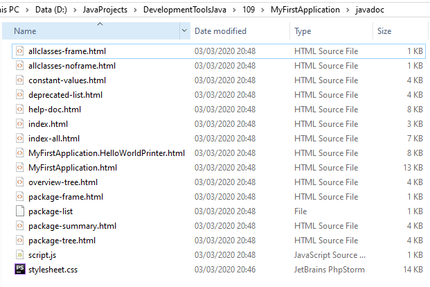

# Development Tools: Java Project

In dit project werken we aan de **Java** opdracht. Hierin werken we aan:
 * Gradle en Java
 * Code Analyse
 * Multi-module projecten
 
## Inhoudsopgave
 T.B.A.
 
## Deploying a Java product without Gradle
 
#### 1. Compile and run the program MyFirstApplication using the javac command
```
javac MyFirstApplication.java
```


#### 2. Discuss: What are the .java and .class files? What happened to the inner class?
`.java` (Java Executable) en `.class` (Java bytecode) zijn verschillend.

##### .java
 * Java Source Code
 * Leesbaar als plain text
 * Wordt later door een compiler omgezet naar verschillende .class bestanden

##### .class
 * Java class bestand
 * Bevat Java bytecode 
 * Kan gebruikt worden door een JVM (Java Virtual Machine)
 * Bevat één class

#### 3 t/m 7
```
D:\JavaProjects\DevelopmentToolsJava\109\MyFirstApplication>mkdir out

D:\JavaProjects\DevelopmentToolsJava\109\MyFirstApplication>mkdir src

D:\JavaProjects\DevelopmentToolsJava\109\MyFirstApplication>move MyFirstApplication.java src
        1 file(s) moved.

D:\JavaProjects\DevelopmentToolsJava\109\MyFirstApplication>javac -d out src/MyFirstApplication.java

D:\JavaProjects\DevelopmentToolsJava\109\MyFirstApplication>java -cp out MyFirstApplication
Congratulations, you have succesfully run this application!
Hello World from an inner class!

D:\JavaProjects\DevelopmentToolsJava\109\MyFirstApplication>
```

#### 8. Create a folder “javadoc” (next to "src" and "out") and generate the Javadoc from MyFirstApplication into this folder
```
D:\JavaProjects\DevelopmentToolsJava\109\MyFirstApplication>mkdir javadoc

D:\JavaProjects\DevelopmentToolsJava\109\MyFirstApplication>javadoc src/* -d javadoc
Loading source file src\MyFirstApplication.java...
Constructing Javadoc information...
Standard Doclet version 1.8.0_231
Building tree for all the packages and classes...
Generating javadoc\MyFirstApplication.html...
Generating javadoc\MyFirstApplication.HelloWorldPrinter.html...
Generating javadoc\package-frame.html...
Generating javadoc\package-summary.html...
Generating javadoc\package-tree.html...
Generating javadoc\constant-values.html...
Building index for all the packages and classes...
Generating javadoc\overview-tree.html...
Generating javadoc\index-all.html...
Generating javadoc\deprecated-list.html...
Building index for all classes...
Generating javadoc\allclasses-frame.html...
Generating javadoc\allclasses-noframe.html...
Generating javadoc\index.html...
Generating javadoc\help-doc.html...
```



#### 9. Discuss: You have seen .jar files before and have worked with them (rather often). Where? What are they used for? What do they contain?
 * JAR staat voor Java Archive
 * Bevat classes en metadata
 * Simpel gezegt een compressed bestand dat de classes en nodige bestanden bevat
 * Bevat alles om het programma te kunnen starten (met Java)
 
#### 10. Create an executable .jar archive using the jar command
```
D:\JavaProjects\DevelopmentToolsJava\109\MyFirstApplication>cd out

D:\JavaProjects\DevelopmentToolsJava\109\MyFirstApplication\out>jar cvfe application.jar MyFirstApplication *.class
added manifest
adding: MyFirstApplication$HelloWorldPrinter.class(in = 569) (out= 362)(deflated 36%)
adding: MyFirstApplication.class(in = 1011) (out= 592)(deflated 41%)

D:\JavaProjects\DevelopmentToolsJava\109\MyFirstApplication\out>java -jar application.jar
Congratulations, you have succesfully run this application!
Hello World from an inner class!
```

#### 11. Extract the contents of the .jar archive using any regular archive tool. Discuss what you find.
```
application
│   MyFirstApplication$HelloWorldPrinter.class
│   MyFirstApplication.class
│
└───META-INF
        MANIFEST.MF
```

#### 12. Send your packaged final product (so .jar and javadoc) to your “customer” (or in this case: your partner). It should work on his system as well, if not, fix any problems that might occur.
Ik heb geen partner, dus ik heb het naar een andere computer overgezet. De jar werkt nog.

 
## Deploying a Java	product	with dependencies without Gradle

#### Head over to https://mvnrepository.com and download the org.json (org.json >> json) package
Deze is gedownload en geplaatst onder 
```
D:\JavaProjects\DevelopmentToolsJava\109\BookCase\json-20190722.jar
```

#### 2. From the command line, compile and execute the BookCase program (using Application.java)
Ik hou van netheid dus ik wil het wel in een out directory hebben. Deze gaan we aanmaken.
```
D:\JavaProjects\DevelopmentToolsJava\109\BookCase>mkdir out
```

**Voor het compileren zie volgende opdracht.**

#### 3. [Challenge] The project also includes a junit test file. Can you get it to run via the command line?
Ja natuurlijk lukt mij dat. JUnit is op dezelfde manier te downloaden als `org.json.json`.
Daarnaast vereist JUnit ook `apiguardian-api`

De huidige jars:
```
BookCase
│
└───lib
       apiguardian-api-1.1.0.jar
       json-20190722.jar
       junit-jupiter-api-5.6.0.jar
```

Om alle .java files te krijgen ga ik een commando gebruiken om een lijst te genereren.
```
dir /S /B *.java > sources.txt
```

#### Uitleg

Het dir commando laat de bestanden in de directory zien. De `>` verteld dat de output ergens heen gepiped moet worden. In dit geval naar `sources.txt`

Command/Flag | Description
 :---:       | :---
**dir**      | Displays a list of files and subdirectories in a directory.
**/S**       | Displays files in specified directory and all subdirectories.
**/B**       | Uses bare format (no heading information or summary).

#### Resultaat

**sources.txt**
```
D:\JavaProjects\DevelopmentToolsJava\109\BookCase\org\saxion\devtools\week1\bookcase\Application.java
D:\JavaProjects\DevelopmentToolsJava\109\BookCase\org\saxion\devtools\week1\bookcase\model\Book.java
D:\JavaProjects\DevelopmentToolsJava\109\BookCase\org\saxion\devtools\week1\bookcase\model\BookCase.java
D:\JavaProjects\DevelopmentToolsJava\109\BookCase\org\saxion\devtools\week1\bookcase\model\BookCaseTest.java
D:\JavaProjects\DevelopmentToolsJava\109\BookCase\org\saxion\devtools\week1\bookcase\model\exceptions\BookCaseOutOfRoomException.java
D:\JavaProjects\DevelopmentToolsJava\109\BookCase\org\saxion\devtools\week1\bookcase\model\exceptions\BookNotFoundException.java
```

**Het compileren**

**Format:** _javac [source files] [options]_

**-classpath** bevat de libraries die geinclude moeten worden. Dit wordt gescheiden met `;`

**-d (directory)** zet de bestanden in de `out` directory

```
javac @sources.txt -classpath lib/json-20190722.jar;lib/junit-jupiter-api-5.6.0.jar;lib/apiguardian-api-1.1.0.jar -d out
```

Nu we de compiled classes hebben kunnen we met **JUnit console Launcher** de tests uitvoeren. Deze vind je op Maven (of in deze repo ;-))

```
D:\JavaProjects\DevelopmentToolsJava\109\BookCase>java -jar junit-platform-console-standalone-1.6.0.jar -class-path out --scan-class-path --disable-ansi-colors

Thanks for using JUnit! Support its development at https://junit.org/sponsoring

.
+-- JUnit Jupiter [OK]
| '-- BookCaseTest [OK]
|   +-- findBookByAuthorExists() [OK]
|   +-- addBookToFullCase() [OK]
|   +-- addBookSuccesfull() [OK]
|   '-- checkIfBookCaseHasSpace() [OK]
'-- JUnit Vintage [OK]

Test run finished after 83 ms
[         3 containers found      ]
[         0 containers skipped    ]
[         3 containers started    ]
[         0 containers aborted    ]
[         3 containers successful ]
[         0 containers failed     ]
[         4 tests found           ]
[         0 tests skipped         ]
[         4 tests started         ]
[         0 tests aborted         ]
[         4 tests successful      ]
[         0 tests failed          ]
```