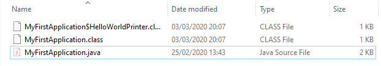
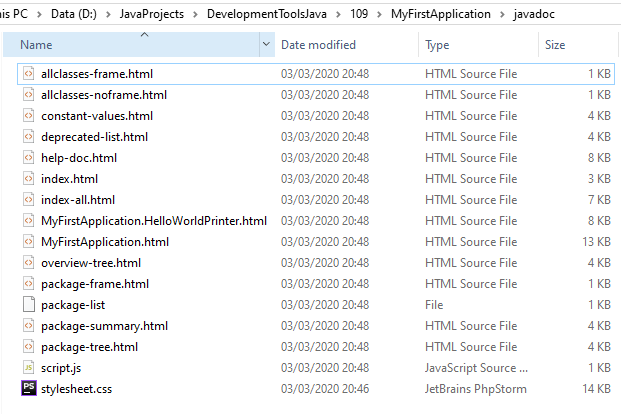

# Java Project: Week 1

In dit project werken we aan de **Java** opdracht. Hierin werken we aan:
 * Gradle en Java
 * ~~Code Analyse~~
 * ~~Multi-module projecten~~
 
## Inhoudsopgave
- [Java Project: Week 1](#java-project--week-1)
  * [Inhoudsopgave](#inhoudsopgave)
  * [Deploying a Java product without Gradle](#deploying-a-java-product-without-gradle)
  * [Deploying a Java product with dependencies without Gradle](#deploying-a-java-product-with-dependencies-without-gradle)
  * [Gradle-fying the build](#gradle-fying-the-build)
  * [Experimenting with your first program using Gradle](#experimenting-with-your-first-program-using-gradle)
  * [Getting the BookCase program to work](#getting-the-bookcase-program-to-work)
  * [Testing the build](#testing-the-build)
 
 
## Deploying a Java product without Gradle
 
#### 1. Compile and run the program MyFirstApplication using the javac command
```
javac MyFirstApplication.java
```


#### 2. Discuss: What are the .java and .class files? What happened to the inner class?
`.java` (Java Executable) en `.class` (Java bytecode) zijn verschillend.

##### .java
 * Java Source Code
 * Leesbaar als plain text
 * Wordt later door een compiler omgezet naar verschillende .class bestanden

##### .class
 * Java class bestand
 * Bevat Java bytecode 
 * Kan gebruikt worden door een JVM (Java Virtual Machine)
 * Bevat één class

#### 3 t/m 7
```
D:\JavaProjects\DevelopmentToolsJava\109\MyFirstApplication>mkdir out

D:\JavaProjects\DevelopmentToolsJava\109\MyFirstApplication>mkdir src

D:\JavaProjects\DevelopmentToolsJava\109\MyFirstApplication>move MyFirstApplication.java src
        1 file(s) moved.

D:\JavaProjects\DevelopmentToolsJava\109\MyFirstApplication>javac -d out src/MyFirstApplication.java

D:\JavaProjects\DevelopmentToolsJava\109\MyFirstApplication>java -cp out MyFirstApplication
Congratulations, you have succesfully run this application!
Hello World from an inner class!

D:\JavaProjects\DevelopmentToolsJava\109\MyFirstApplication>
```

#### 8. Create a folder “javadoc” (next to "src" and "out") and generate the Javadoc from MyFirstApplication into this folder
```
D:\JavaProjects\DevelopmentToolsJava\109\MyFirstApplication>mkdir javadoc

D:\JavaProjects\DevelopmentToolsJava\109\MyFirstApplication>javadoc src/* -d javadoc
Loading source file src\MyFirstApplication.java...
Constructing Javadoc information...
Standard Doclet version 1.8.0_231
Building tree for all the packages and classes...
Generating javadoc\MyFirstApplication.html...
Generating javadoc\MyFirstApplication.HelloWorldPrinter.html...
Generating javadoc\package-frame.html...
Generating javadoc\package-summary.html...
Generating javadoc\package-tree.html...
Generating javadoc\constant-values.html...
Building index for all the packages and classes...
Generating javadoc\overview-tree.html...
Generating javadoc\index-all.html...
Generating javadoc\deprecated-list.html...
Building index for all classes...
Generating javadoc\allclasses-frame.html...
Generating javadoc\allclasses-noframe.html...
Generating javadoc\index.html...
Generating javadoc\help-doc.html...
```



#### 9. Discuss: You have seen .jar files before and have worked with them (rather often). Where? What are they used for? What do they contain?
 * JAR staat voor Java Archive
 * Bevat classes en metadata
 * Simpel gezegt een compressed bestand dat de classes en nodige bestanden bevat
 * Bevat alles om het programma te kunnen starten (met Java)
 
#### 10. Create an executable .jar archive using the jar command
```
D:\JavaProjects\DevelopmentToolsJava\109\MyFirstApplication>cd out

D:\JavaProjects\DevelopmentToolsJava\109\MyFirstApplication\out>jar cvfe application.jar MyFirstApplication *.class
added manifest
adding: MyFirstApplication$HelloWorldPrinter.class(in = 569) (out= 362)(deflated 36%)
adding: MyFirstApplication.class(in = 1011) (out= 592)(deflated 41%)

D:\JavaProjects\DevelopmentToolsJava\109\MyFirstApplication\out>java -jar application.jar
Congratulations, you have succesfully run this application!
Hello World from an inner class!
```

#### 11. Extract the contents of the .jar archive using any regular archive tool. Discuss what you find.
```
application
│   MyFirstApplication$HelloWorldPrinter.class
│   MyFirstApplication.class
│
└───META-INF
        MANIFEST.MF
```

#### 12. Send your packaged final product (so .jar and javadoc) to your “customer” (or in this case: your partner). It should work on his system as well, if not, fix any problems that might occur.
Ik heb geen partner, dus ik heb het naar een andere computer overgezet. De jar werkt nog.

 
## Deploying a Java	product	with dependencies without Gradle

#### Head over to https://mvnrepository.com and download the org.json (org.json >> json) package
Deze is gedownload en geplaatst onder 
```
D:\JavaProjects\DevelopmentToolsJava\109\BookCase\json-20190722.jar
```

#### 2. From the command line, compile and execute the BookCase program (using Application.java)
Ik hou van netheid dus ik wil het wel in een out directory hebben. Deze gaan we aanmaken.
```
D:\JavaProjects\DevelopmentToolsJava\109\BookCase>mkdir out
```

**Voor het compileren zie volgende opdracht.**

#### 3. [Challenge] The project also includes a junit test file. Can you get it to run via the command line?
Ja natuurlijk lukt mij dat. JUnit is op dezelfde manier te downloaden als `org.json.json`.
Daarnaast vereist JUnit ook `apiguardian-api`

De huidige jars:
```
BookCase
│
└───lib
       apiguardian-api-1.1.0.jar
       json-20190722.jar
       junit-jupiter-api-5.6.0.jar
```

Om alle .java files te krijgen ga ik een commando gebruiken om een lijst te genereren.
```
dir /S /B *.java > sources.txt
```

#### Uitleg

Het dir commando laat de bestanden in de directory zien. De `>` verteld dat de output ergens heen gepiped moet worden. In dit geval naar `sources.txt`

Command/Flag | Description
 :---:       | :---
**dir**      | Displays a list of files and subdirectories in a directory.
**/S**       | Displays files in specified directory and all subdirectories.
**/B**       | Uses bare format (no heading information or summary).

#### Resultaat

**sources.txt**
```
D:\JavaProjects\DevelopmentToolsJava\109\BookCase\org\saxion\devtools\week1\bookcase\Application.java
D:\JavaProjects\DevelopmentToolsJava\109\BookCase\org\saxion\devtools\week1\bookcase\model\Book.java
D:\JavaProjects\DevelopmentToolsJava\109\BookCase\org\saxion\devtools\week1\bookcase\model\BookCase.java
D:\JavaProjects\DevelopmentToolsJava\109\BookCase\org\saxion\devtools\week1\bookcase\model\BookCaseTest.java
D:\JavaProjects\DevelopmentToolsJava\109\BookCase\org\saxion\devtools\week1\bookcase\model\exceptions\BookCaseOutOfRoomException.java
D:\JavaProjects\DevelopmentToolsJava\109\BookCase\org\saxion\devtools\week1\bookcase\model\exceptions\BookNotFoundException.java
```

**Het compileren**

**Format:** _javac [source files] [options]_

**-classpath** bevat de libraries die geinclude moeten worden. Dit wordt gescheiden met `;`

**-d (directory)** zet de bestanden in de `out` directory

```
javac @sources.txt -classpath lib/json-20190722.jar;lib/junit-jupiter-api-5.6.0.jar;lib/apiguardian-api-1.1.0.jar -d out
```

Nu we de compiled classes hebben kunnen we met **JUnit console Launcher** de tests uitvoeren. Deze vind je op Maven (of in deze repo ;-))

```
D:\JavaProjects\DevelopmentToolsJava\109\BookCase>java -jar junit-platform-console-standalone-1.6.0.jar -class-path out --scan-class-path --disable-ansi-colors

Thanks for using JUnit! Support its development at https://junit.org/sponsoring

.
+-- JUnit Jupiter [OK]
| '-- BookCaseTest [OK]
|   +-- findBookByAuthorExists() [OK]
|   +-- addBookToFullCase() [OK]
|   +-- addBookSuccesfull() [OK]
|   '-- checkIfBookCaseHasSpace() [OK]
'-- JUnit Vintage [OK]

Test run finished after 83 ms
[         3 containers found      ]
[         0 containers skipped    ]
[         3 containers started    ]
[         0 containers aborted    ]
[         3 containers successful ]
[         0 containers failed     ]
[         4 tests found           ]
[         0 tests skipped         ]
[         4 tests started         ]
[         0 tests aborted         ]
[         4 tests successful      ]
[         0 tests failed          ]
```


## Gradle-fying	the	build
 
#### 1. Create an empty folder "MyFirstGradleApplication" and inside this folder run “gradle tasks”. What kind of tasks can be executed?

```gradle
D:\JavaProjects\DevelopmentToolsJava\109\MyFirstApplication\gradle_experiment>gradle tasks

> Task :tasks

------------------------------------------------------------
Tasks runnable from root project
------------------------------------------------------------

Build Setup tasks
-----------------
init - Initializes a new Gradle build.
wrapper - Generates Gradle wrapper files.

Help tasks
----------
buildEnvironment - Displays all buildscript dependencies declared in root project 'gradle_experiment'.
components - Displays the components produced by root project 'gradle_experiment'. [incubating]
dependencies - Displays all dependencies declared in root project 'gradle_experiment'.
dependencyInsight - Displays the insight into a specific dependency in root project 'gradle_experiment'.
dependentComponents - Displays the dependent components of components in root project 'gradle_experiment'. [incubating]
help - Displays a help message.
model - Displays the configuration model of root project 'gradle_experiment'. [incubating]
outgoingVariants - Displays the outgoing variants of root project 'gradle_experiment'.
projects - Displays the sub-projects of root project 'gradle_experiment'.
properties - Displays the properties of root project 'gradle_experiment'.
tasks - Displays the tasks runnable from root project 'gradle_experiment'.

To see all tasks and more detail, run gradle tasks --all

To see more detail about a task, run gradle help --task <task>

Deprecated Gradle features were used in this build, making it incompatible with Gradle 7.0.
Use '--warning-mode all' to show the individual deprecation warnings.
See https://docs.gradle.org/6.1.1/userguide/command_line_interface.html#sec:command_line_warnings

BUILD SUCCESSFUL in 1s
1 actionable task: 1 executed
```

#### 2. Inside the empty folder you've created, initialize a Gradle project with the gradle init task.
```
D:\JavaProjects\DevelopmentToolsJava\109\MyFirstApplication\gradle_experiment>gradle init

Select type of project to generate:
  1: basic
  2: application
  3: library
  4: Gradle plugin
Enter selection (default: basic) [1..4] 2

Select implementation language:
  1: C++
  2: Groovy
  3: Java
  4: Kotlin
  5: Swift
Enter selection (default: Java) [1..5] 3

Select build script DSL:
  1: Groovy
  2: Kotlin
Enter selection (default: Groovy) [1..2] 1

Select test framework:
  1: JUnit 4
  2: TestNG
  3: Spock
  4: JUnit Jupiter
Enter selection (default: JUnit 4) [1..4] 1

Project name (default: gradle_experiment): MyFirstApplication
Source package (default: MyFirstApplication): org.saxion.devtools.week1.myfirstapplication

> Task :init
Get more help with your project: https://docs.gradle.org/6.1.1/userguide/tutorial_java_projects.html

BUILD SUCCESSFUL in 1m 19s
2 actionable tasks: 2 executed
```

#### 3. Take a look at the results of the task and explain to each other what the contents of each folder are. If you are unsure, consult the documentation

Folder          | Description
---             | ---
.gradle         | Dit gebruikt gradle om cache in op te slaan
gradle\wrapper  | Bevat de configuratie en huidige versie van Gradle zodat het zonder problemen op een andere computer kan worden uitgevoerd.
src\main        | (Gaat) de code bevatten van je applicatie
src\test        | (Gaat) de code bevatten van je JUnit tests

#### 4. Have a look at the produced build.gradle file. Why are there now two plugins?

```gradle
plugins {
    // Apply the java plugin to add support for Java
    id 'java'

    // Apply the application plugin to add support for building a CLI application.
    id 'application'
}
```

**Uitleg**

Plugin      | Description
---         | ---
java        | De Java plugin zorgt ervoor dat Gradle support bied voor Java, wel zo handig
application | Deze plugin kan een uitvoerbaare JVM applicatie maken

#### 5. Copy the MyFirstApplication.java source file from the previous exercise into the newly created source folder.
Done!

#### 6. Rerun gradle tasks and see what is possible now

```
D:\JavaProjects\DevelopmentToolsJava\109\MyFirstApplication\gradle_experiment>gradle tasks

> Task :tasks

------------------------------------------------------------
Tasks runnable from root project
------------------------------------------------------------

Application tasks
-----------------
run - Runs this project as a JVM application

Build tasks
-----------
assemble - Assembles the outputs of this project.
build - Assembles and tests this project.
buildDependents - Assembles and tests this project and all projects that depend on it.
buildNeeded - Assembles and tests this project and all projects it depends on.
classes - Assembles main classes.
clean - Deletes the build directory.
jar - Assembles a jar archive containing the main classes.
testClasses - Assembles test classes.

Build Setup tasks
-----------------
init - Initializes a new Gradle build.
wrapper - Generates Gradle wrapper files.

Distribution tasks
------------------
assembleDist - Assembles the main distributions
distTar - Bundles the project as a distribution.
distZip - Bundles the project as a distribution.
installDist - Installs the project as a distribution as-is.

Documentation tasks
-------------------
javadoc - Generates Javadoc API documentation for the main source code.

Help tasks
----------
buildEnvironment - Displays all buildscript dependencies declared in root project 'MyFirstApplication'.
components - Displays the components produced by root project 'MyFirstApplication'. [incubating]
dependencies - Displays all dependencies declared in root project 'MyFirstApplication'.
dependencyInsight - Displays the insight into a specific dependency in root project 'MyFirstApplication'.
dependentComponents - Displays the dependent components of components in root project 'MyFirstApplication'. [incubating]
help - Displays a help message.
model - Displays the configuration model of root project 'MyFirstApplication'. [incubating]
outgoingVariants - Displays the outgoing variants of root project 'MyFirstApplication'.
projects - Displays the sub-projects of root project 'MyFirstApplication'.
properties - Displays the properties of root project 'MyFirstApplication'.
tasks - Displays the tasks runnable from root project 'MyFirstApplication'.

Verification tasks
------------------
check - Runs all checks.
test - Runs the unit tests.

Rules
-----
Pattern: clean<TaskName>: Cleans the output files of a task.
Pattern: build<ConfigurationName>: Assembles the artifacts of a configuration.
Pattern: upload<ConfigurationName>: Assembles and uploads the artifacts belonging to a configuration.

To see all tasks and more detail, run gradle tasks --all

To see more detail about a task, run gradle help --task <task>

BUILD SUCCESSFUL in 4s
1 actionable task: 1 executed
```

#### 7. Build and run the program and answer the following questions

##### Build

```
D:\JavaProjects\DevelopmentToolsJava\109\MyFirstApplication\gradle_experiment>gradle build

BUILD SUCCESSFUL in 8s
7 actionable tasks: 7 executed
```

##### Run

```
D:\JavaProjects\DevelopmentToolsJava\109\MyFirstApplication\gradle_experiment>gradle run

> Task :run
Hello world.

BUILD SUCCESSFUL in 1s
2 actionable tasks: 1 executed, 1 up-to-date
```

###### What steps does Gradle take?
```
> Task :compileJava
> Task :processResources NO-SOURCE
> Task :classes
> Task :jar
> Task :startScripts
> Task :distTar
> Task :distZip
> Task :assemble
> Task :compileTestJava
> Task :processTestResources NO-SOURCE
> Task :testClasses
> Task :test
> Task :check
> Task :build
```

###### Where do the build artefacts go?
To the `out` folder

###### What artefacts are generated by default?
De compiled java bytecode

#### 8. Gradle has a default task to remove all build artefacts. Which one is it?
`gradle clean`

```
D:\JavaProjects\DevelopmentToolsJava\109\MyFirstApplication\gradle_experiment>gradle clean

BUILD SUCCESSFUL in 1s
1 actionable task: 1 executed
```

## Experimenting with your first program using Gradle

#### 1. Generate some Javadoc by using the appropriate task.

```
D:\JavaProjects\DevelopmentToolsJava\109\MyFirstApplication\gradle_experiment>gradle javadoc

BUILD SUCCESSFUL in 1s
2 actionable tasks: 2 executed
```

#### 2. [Challenge] Create an executable jar using Gradle, similar to what you did before on the command line.

```
D:\JavaProjects\DevelopmentToolsJava\109\MyFirstApplication\gradle_experiment>gradle jar

BUILD SUCCESSFUL in 1s
2 actionable tasks: 1 executed, 1 up-to-date
```

```
├───libs
│       MyFirstApplication.jar
│
```

## Getting the BookCase program to work

#### 1. Create a new folder (using the same layout as before) or use gradle init and copy in the contents of the BookCase application, including the test.

```
D:\JavaProjects\DevelopmentToolsJava\109\BookCase-Gradle>gradle init

Select type of project to generate:
  1: basic
  2: application
  3: library
  4: Gradle plugin
Enter selection (default: basic) [1..4] 2

Select implementation language:
  1: C++
  2: Groovy
  3: Java
  4: Kotlin
  5: Swift
Enter selection (default: Java) [1..5] 3

Select build script DSL:
  1: Groovy
  2: Kotlin
Enter selection (default: Groovy) [1..2] 1

Select test framework:
  1: JUnit 4
  2: TestNG
  3: Spock
  4: JUnit Jupiter
Enter selection (default: JUnit 4) [1..4] 4

Project name (default: BookCase-Gradle):
Source package (default: BookCase.Gradle): org.saxion.devtools.week1.bookcase

> Task :init
Get more help with your project: https://docs.gradle.org/6.1.1/userguide/tutorial_java_projects.html

BUILD SUCCESSFUL in 1m 30s
2 actionable tasks: 2 executed
```

#### 2. Try to run your program using the 'Application' plugin. It will most likely fail.

```
D:\JavaProjects\DevelopmentToolsJava\109\BookCase-Gradle>gradle run

> Task :compileJava FAILED
D:\JavaProjects\DevelopmentToolsJava\109\BookCase-Gradle\src\main\java\org\saxion\devtools\week1\bookcase\Application.java:3: error: package org.json does not exist
import org.json.JSONArray;
               ^
```

Het is gefaald omdat `package org.json does not exist`. Dat is logisch, want die is nog niet geinclude.

#### 3. Resolve the problem with the compilation. 

Adding dependency to `build.gradle`:

```
implementation group: 'org.json', name: 'json', version: '20190722'
```

Works now!
```
D:\JavaProjects\DevelopmentToolsJava\109\BookCase-Gradle>gradle build

BUILD SUCCESSFUL in 1s
7 actionable tasks: 7 up-to-date
```

## Testing the build

#### 1. Run the gradle test directive and see whether the test fails or succeeds.

```
D:\JavaProjects\DevelopmentToolsJava\109\BookCase-Gradle>gradle test

BUILD SUCCESSFUL in 1s
3 actionable tasks: 3 up-to-date
```

#### 2. Look for the test results. They are considered a build artefact. Did the tests succeed?

```xml
<?xml version="1.0" encoding="UTF-8"?>
<testsuite name="org.saxion.devtools.week1.bookcase.model.BookCaseTest" tests="4" skipped="0" failures="0" errors="0" timestamp="2020-03-05T14:41:13" hostname="DESKTOP-13N0A6V" time="0.022">
  <properties/>
  <testcase name="findBookByAuthorExists()" classname="org.saxion.devtools.week1.bookcase.model.BookCaseTest" time="0.016"/>
  <testcase name="addBookToFullCase()" classname="org.saxion.devtools.week1.bookcase.model.BookCaseTest" time="0.002"/>
  <testcase name="addBookSuccesfull()" classname="org.saxion.devtools.week1.bookcase.model.BookCaseTest" time="0.0"/>
  <testcase name="checkIfBookCaseHasSpace()" classname="org.saxion.devtools.week1.bookcase.model.BookCaseTest" time="0.001"/>
  <system-out><![CDATA[]]></system-out>
  <system-err><![CDATA[]]></system-err>
</testsuite>
```

Ja de tests zijn geslaagd. Dat kun je zien aan `failures="0" errors="0" `