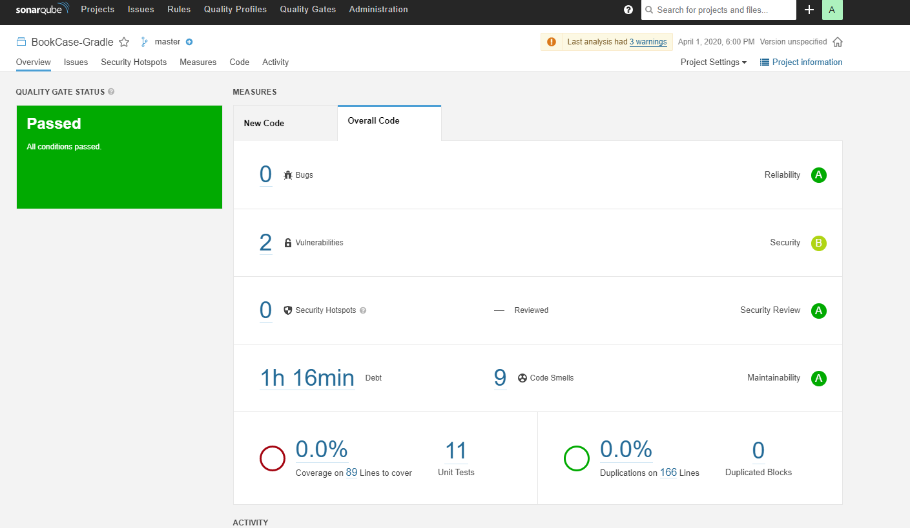

# Java Project: Week 2

In dit project werken we aan de **Java** opdracht. Hierin werken we aan:
 * ~~Gradle en Java~~
 * Code Analyse
 * ~~Multi-module projecten~~
 
## Inhoudsopgave
- [Java Project: Week 2](#java-project--week-2)
  * [Inhoudsopgave](#inhoudsopgave)
  * [Checking coding  standards   with    Checkstyle](#checking-coding--standards---with----checkstyle)
  * [Finding bugs with SpotBugs](#finding-bugs-with-spotbugs)
  * [Code Coverage with JaCoCo](#code-coverage-with-jacoco)
  * [Using integrated platforms: SonarQube](#using-integrated-platforms--sonarqube)
  * [Do it yourself!](#do-it-yourself-)
      - [Errors](#errors)
 
## Checking	coding	standards	with	Checkstyle
 
#### 1. Go to the Checkstyle plugin page and apply the plugin

build.grade
```groovy
plugins {
    // Checkstyle plugin https://docs.gradle.org/current/userguide/checkstyle_plugin.html
    id 'checkstyle'
}
```

#### 2. Create a basic Checkstyle configuration file (or get the Google version online!) and place it in the default location

I got the Google version from [here](https://raw.githubusercontent.com/checkstyle/checkstyle/master/src/main/resources/google_checks.xml)

```
BookCase-Gradle
├───config
│   └───checkstyle
│           checkstyle.xml
```

#### 3. After your configuration file is in place, make sure to test your configuration by running the appropriate task and take a look at the results

Running `gradle check`

**Artefacts**

```
build
└──reports
   └────checkstyle
          main.html
          main.xml
          test.html
          test.xml
```

#### 4. What Java plugin tasks gets an additional dependency thanks to the Checkstyle plugin?
Dat is de `check` task. Die runt nu ook de checkstyle

#### 5. Design a Checkstyle configuration document based on existing Checkstyle modules in which you check that your project adheres to at least ten (10) coding standards of your choosing.

| Module                                 | Description
| :------------------------------------  | :---------------------------------------------
| EmptyBlock                             | Checks for empty blocks.
| AvoidStarImport                        | Checks that there are no import statements that use the * notation.
| MethodLength                           | Checks for long methods and constructors.
| OneTopLevelClass                       | Checks that each top-level class, interface or enum resides in a source file of its own.
| OverloadMethodsDeclarationOrder        | Checks that overload methods are grouped together.
| SimplifyBooleanReturn                  | Checks for over-complicated boolean expressions.
| SimplifyBooleanExpression              | Checks for over-complicated boolean return statements.
| TodoComment                            | Checks for TODO: comments.
| UnusedImports                          | Checks for unused import statements.
| MissingSwitchDefault                   | Checks that switch statement has a default clause.


#### 6. [Deliverable] Create a document that explains your own coding standard. You do not need to copy your configuration (you can just submit the XML), but we would like to see "some" reasoning on why you chose the checks you have opted for. You'll submit this document as part of your first turn-in in the upcoming weeks

| Module                                 | Redenering
| :------------------------------------  | :---------------------------------------------
| EmptyBlock                             | Ik wil geen onnodige dingen in de code. Dat zal ook gelden voor veel andere dingen in deze tabel.
| AvoidStarImport                        | Het staat netter, gebruikt minder ruimte en is nog sneller ook
| MethodLength                           | Lange methodes maken je code onleesbaar. Het is beter om ze op te delen
| OneTopLevelClass                       | Elke class moet zijn eigen file hebben. Anders raak je het overzicht kwijt.
| OverloadMethodsDeclarationOrder        | Als je methodes overload, zorg dan dat ze dichtbij elkaar staan, anders raak je het overzicht kwijt
| SimplifyBooleanReturn                  | Zodat je snel door de code kan lezen zonder een return te ontcijferen
| SimplifyBooleanExpression              | Zelfde als SimplifyBooleanReturn. Verbeterd de leesbaarheid
| TodoComment                            | Als een TODO klaar is, haal de comment dan weg...
| UnusedImports                          | Zelfde als StarImport. Het is niet nodig, kost ruimte en maakt het programma langzamer
| MissingSwitchDefault                   | Ik vergeet deze nog wel eens. Dus als reminder!

## Finding bugs with SpotBugs

#### 1. Look at SpotBugs documentation: how many detectors are there and what are they looking for? 
>SpotBugs checks for more than 400 bug patterns.

Ze zoeken naar:
 * Bad practice
 * Correctness
 * Experimental
 * Internationalization
 * Malicious code vulnerability
 * Multithreaded correctness
 * Bogus random noise
 * Performance
 * Security
 * Dodgy code

#### 2. Apply the SpotBugs plugin using the Gradle documentation, run the check and take a look at the output. What do you see?
```
D:\JavaProjects\DevelopmentToolsJava\109\BookCase-Gradle>gradlew build
> Task :spotbugsMain FAILED

FAILURE: Build failed with an exception.

* What went wrong:
Execution failed for task ':spotbugsMain'.
> A failure occurred while executing com.github.spotbugs.snom.internal.SpotBugsRunnerForWorker$SpotBugsExecutor
   > Verification failed: SpotBugs execution thrown exception

* Try:
Run with --stacktrace option to get the stack trace. Run with --info or --debug option to get more log output. Run with --scan to get full insights.

* Get more help at https://help.gradle.org

BUILD FAILED in 6s
11 actionable tasks: 1 executed, 10 up-to-date
```

Dan gaan we kijken in de output, en dan zien we dat SpotBugs een html bestand heeft gemaakt. Hierin staan 2 bugs: Internationalization; Security

#### 3. What do you think of SpotBugs “breaking” your build?
Ik vind het niet zo fijn, ik had een beter bericht verwacht om wat voor error het gaat. Ik ben een uur kwijt geweest aan dit, want ik dacht dat spotbugs niet werkte...

#### 4. Based on your knowledge of the different detectors: Create three *new* different bugs in the BookCase project that SpotBugs can find and add them to your documentation.
| Bug                                    | Wat         | Hoe
| :------------------------------------  | :---------------------------------------------| :---------------------------------------------
| Bad Practice                           | Method invokes System.exit(…)         |`System.exit(1)`
| Performance                            | Method invokes inefficient new String() constructor         | `new String();`
| Dodgy Code                             | Covariant array assignment to a local variable | `Number[] arr = new Integer[10]; arr[0] = 1.0;`

## Code Coverage with JaCoCo

Apply the "JaCoCo" plugin to the BookCase project and generate a jacocoTestReport (this is a task!

#### 1. Find the report (it's an artefact) and discuss this with your colleague
```
D:\JavaProjects\DevelopmentToolsJava\109\BookCase-Gradle>gradlew jacocoTestReport
```
D:\JavaProjects\DevelopmentToolsJava\109\BookCase-Gradle\build\reports\jacoco\test\html\index.html

#### 2. Write a few more tests for the BookCase class. Try to reach at least 80% code coverage on this class. Add a list of your added tests (no explanation required) to your report so we can easily spot what tests you added.
 * checkIfBookCaseHasNoSpace
 * findBookByTitleExists
 * findBookByTitleNotExists
 * removedBookIsGone
 * removeNonExistingBookThrowsException
 * toStringIsNotEmpty
 
 
## Using integrated platforms: SonarQube

#### 1. Take a look at https://www.sonarqube.org/
**a) What languages does SonarQube support?**
 * Java
 * C#
 * C
 * C++
 * JavaScript
 * TypeScript
 * Python
 * GO
 * Swift
 * COBOL
 * Apex
 * PHP
 * Kotlin
 * Ruby
 * Scala
 * HTML5
 * CSS3
 * ABAP
 * Flex
 * Objective-C
 * PL/I
 * PL/SQL
 * RPG
 * T-SQL
 * Visual Basic
 * VB6
 * XML
 
**b) What kind of issues can SonarQube detect?**

Drie type issues (met daarin natuurlijk een gigantische onderverdeling):
 * Bug
 * Vulnerability
 * Code Smell
 
#### 2. Download and run SonarQube locally and have a go at it: What do you see? Can you make sense of it all?
Ik had Java 11 nodig. Dus dat heb ik even geinstallerd. De stappen gevolgd en nu ben ik ingelogd op localhost:9000

#### 3. Configure the SonarQube plugin and run an analysis of your BookCase project using SonarQube


## Do it yourself!

#### Errors
Er zijn in totaal 25 bugs in 24 classes gerapporteerd door Spotbugs